# Goals
By the end of this short lab, you will have created your first AI agent. It doesn't do a whole lot, except to proxy the conversation between n8n's native chat interface and your LLM (Ollama), but it will clearly display the power that an agent provides and it will set you up for easy AI powered automation.

# Prerequisites
1. You must have completed our [Ollama Basics lab](ollama_basics) to have Ollama running on your computer. We will be connecting to your local Ollama implementation in this lab.
2. You must have docker installed and running on the machine you're using for the lab. It must also be configured for host networking or you will not be able to access your n8n implementation.

# Steps
1. First, we need to make sure that Ollama is listening on all ports (or just your real v4 IP, if you want)
`export OLLAMA_HOST="0.0.0.0"; ollama serve &`
2. Then, create a docker volume for the n8n data to live on. 
`docker volume create n8n_data`
3. Next, we will issue a single docker command to download the latest n8n container, set the host networking ports, connect to your n8n_data volume and run it!
`docker run -it --rm --name n8n -p 5678:5678 -v n8n_data:/home/node/.n8n docker.n8n.io/n8nio/n8n`
4. Now, it's time to open your browser to http://your-ip-address:5678 and create an owner account for the instance:
   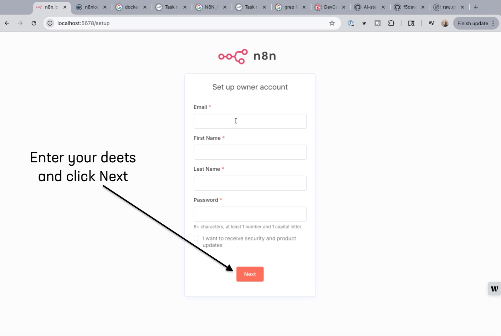
5. Click past the customization screen:
   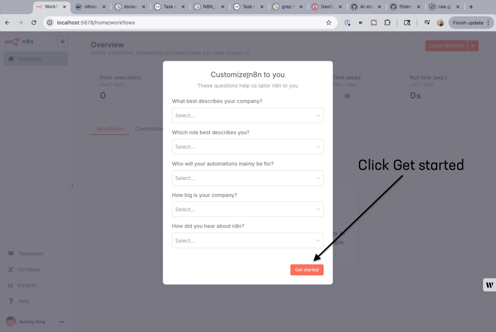
6. Request your free community license activation key and apply it:
   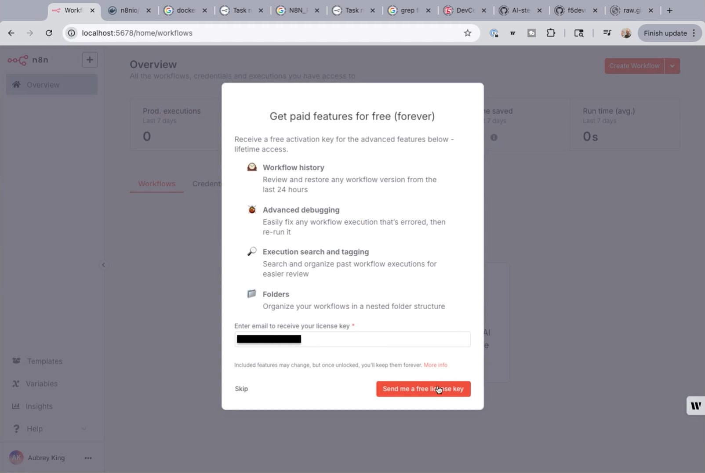
7. Click usage and plan to enter your license key that should be in your email:
   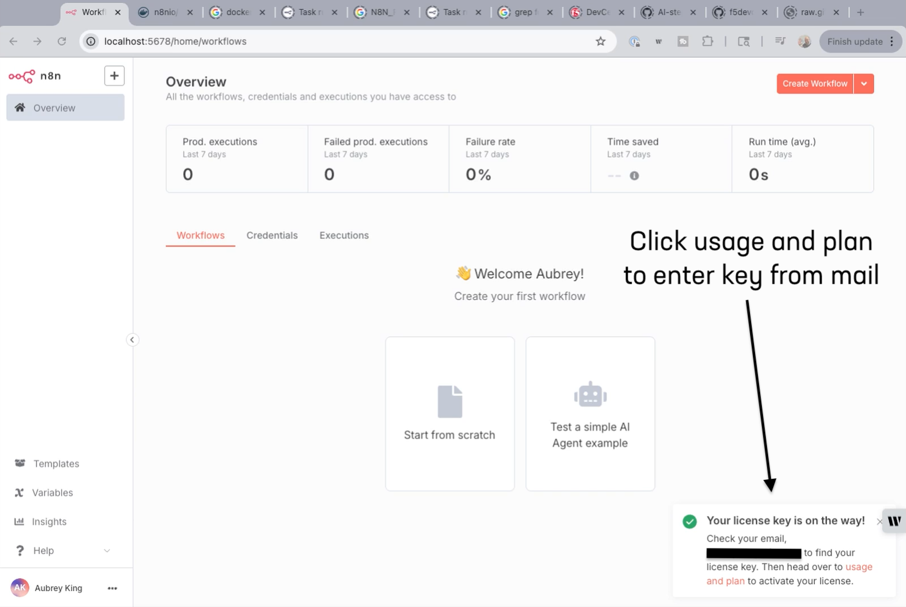
8. Click the Enter activation key button and paste your key in from your email:
   
   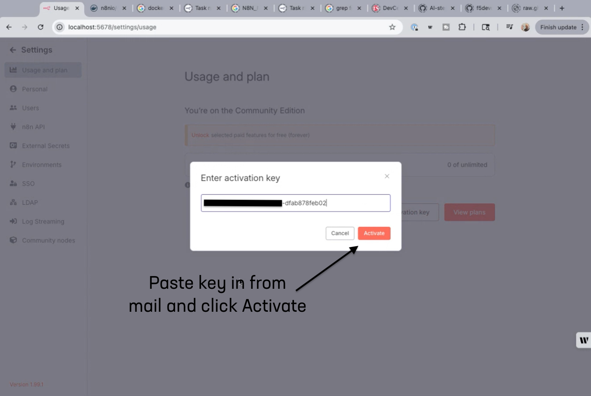
9. Create a new workflow by clicking the + button in the top left of the screen and select Workflow from the drop-down:
   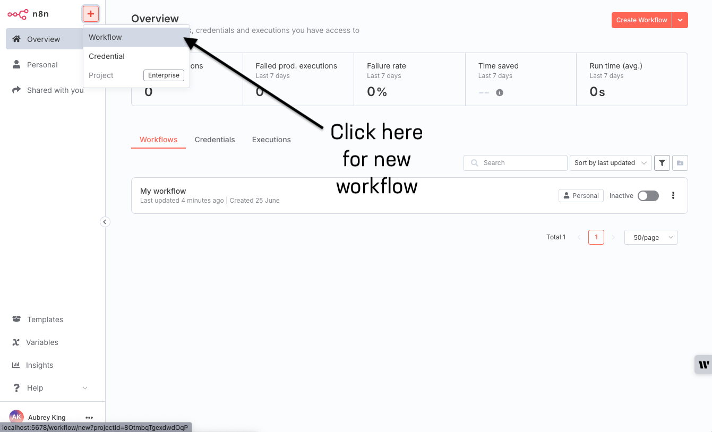
10. Trigger your flow with a chat message. Click the big + in the center of the canvas and select On chat message.
   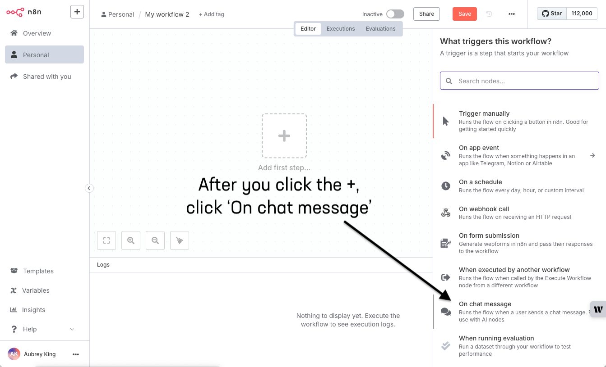
11. Create your agent! Click the + icon that is attached to your trigger and select AI > AI Agent from the side menu. When your agent definition screen comes up, take a look around, but change nothing and head back to your canvas:
   
   
   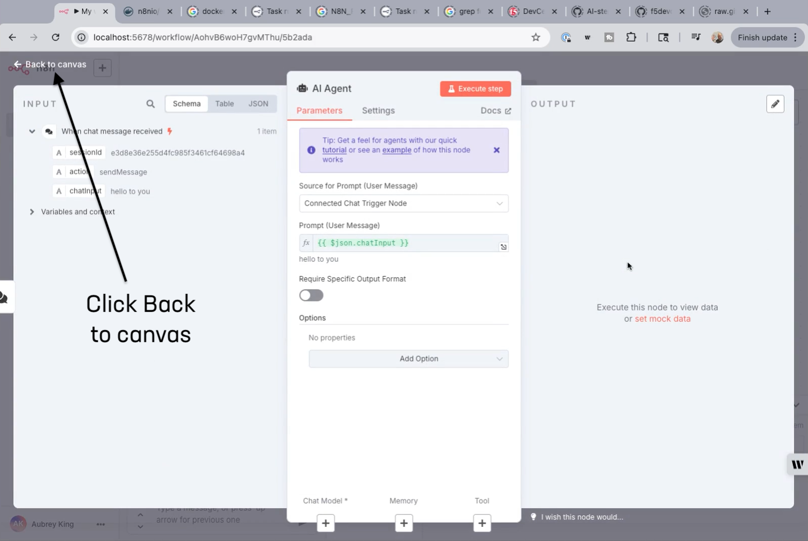
12. Enable your agent with Ollama. Click the add chat model button, then select Ollama Chat Model from the side menu. When the Ollama definition screen comes up, click in the box and create new credentials. All you need to do for ollama credentials is to set the actual IP of your host machine. Do not use 127.0.0.1, either. Once complete, close out of the definition screen:
   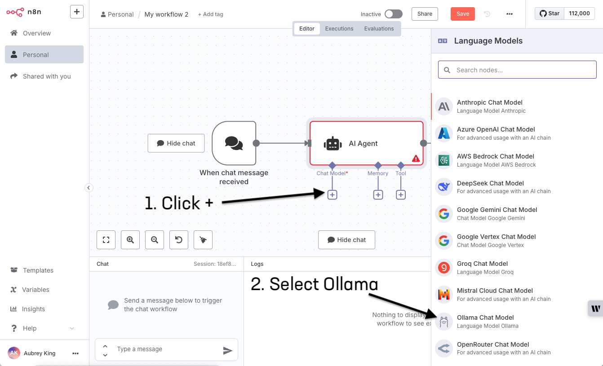
   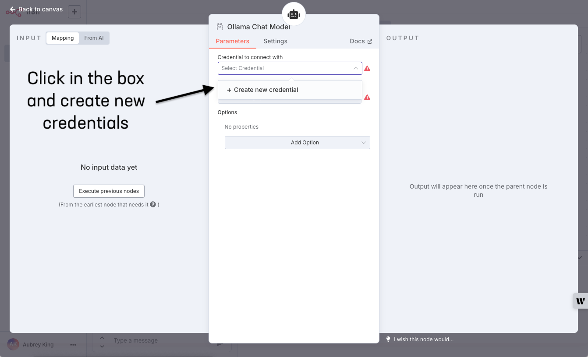
   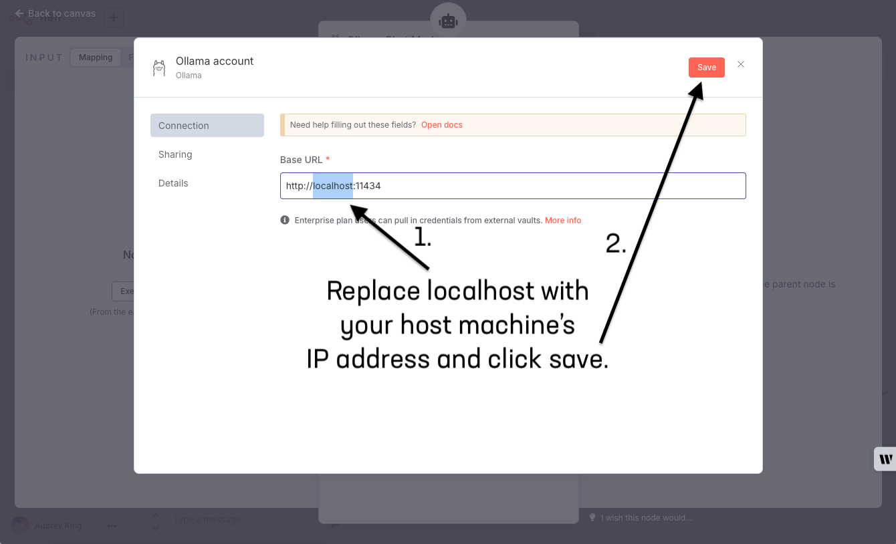
   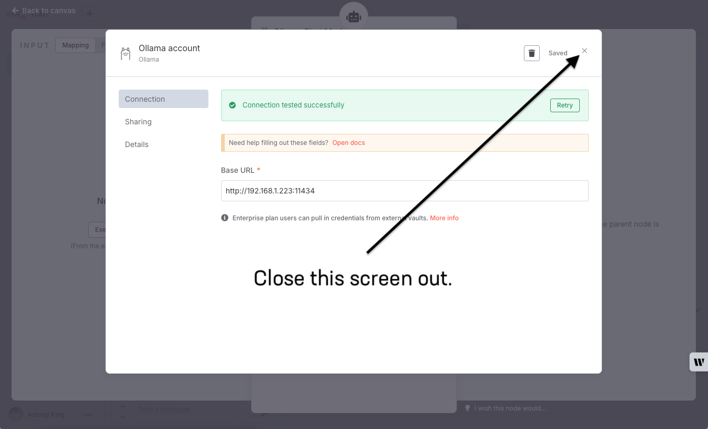
13. TEST IT OUT!! Type Hello World in the chat box and watch in amazement as you proxy your first chat conversation through an agent.
   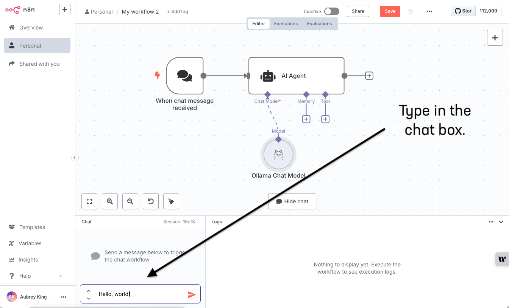
   
14. Homework: Now that you've done the lab, explore the memory and tool options in your agent. The memory allows you to insert your chat data in any of a number of databases. The tools are connectors to various other resources and web utilities like ticketing services and chats. Check out the various triggers besides  Please imagine the possibilities for automating a million things in your work day with simple chats.
